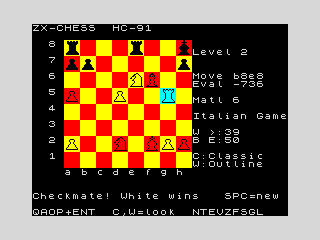

# Sample game — Claude (human side) vs ZX-CHESS (computer side)

A complete game in which **Claude AI played the human side** and the
**ZX-CHESS engine played the computer side**, run on the HC-91 emulator and
driven entirely through machine memory (no screenshots, no OCR — moves are
entered as cursor keystrokes and the reply is read straight from the board
array). It is *not* an engine self-play game: every White move was chosen by
Claude; every Black move was chosen by the ZX-CHESS search.

* **Result:** **1-0** — White (Claude) checkmates Black with **32.Rg5#**.
* **Setup:** Claude = White (the on-board "human"); ZX-CHESS = Black at
  **Level 2 of 5** (2-ply search — the program's default, mid-low on its
  1–5 difficulty scale; see *Engine strength* below). Opening: Italian Game.
* **Verified:** the program's own terminal detection printed
  **"Checkmate! White wins"** (game-state byte = "black mated", the engine's
  self-evaluation `Eval -736` = a lost position).



## Moves

```
 1. e4    e5      2. Nf3   Nc6     3. Bc4   Bc5     4. c3    Nf6
 5. d4    Bb6     6. d5    Na5     7. Bd3   d6      8. b4    Ng4
 9. O-O   Nxf2   10. Rxf2  Bxf2+  11. Kxf2  c6     12. Qa4   Qb6
13. Be3   Qc7    14. bxa5  Bd7    15. Qb3   cxd5   16. exd5  O-O
17. c4    Rb8    18. c5    dxc5   19. Qc3   Rbe8   20. Qxc5  Qxc5
21. Bxc5  e4     22. Bxe4  Rxe4   23. Nbd2  Re8    24. Re1   Rd8
25. Re7   Rf8    26. Rxd7  Rfc8   27. Bd4   Rcb8   28. Ng5   f6
29. Ne6   g5     30. Rg7+  Kh8    31. Bxf6  Rbe8   32. Rg5#  1-0
```

## The story of the game

* **8.b4!** is the turning point. After 6.d5 Na5 7.Bd3 d6, the a5-knight had
  no safe retreat: `b3` runs into axb3, `c4` into Bxc4, `c6` is blocked by
  Black's own pawn. The knight was trapped on the rim.
* **9.O-O** was the only accurate way to collect it. Black's desperado
  **9...Nxf2** looked like a fork of the queen and rook, but with the rook
  already on f1 the shot simply fails: 10.Rxf2 Bxf2+ 11.Kxf2 and after
  **12.Qa4 / 13.Be3 / 14.bxa5** White has won a clean piece.
* White then converted: **15...cxd5 16.exd5** kept a protected passed pawn,
  **25.Re7** seized the seventh rank, **26.Rxd7** won a second piece when the
  rook that guarded the bishop stepped away, and the knight manoeuvre
  **28.Ng5 / 29.Ne6** built a mating net around the king.
* **32.Rg5#** is a **discovered-check mate**: the rook vacates g7, unmasking
  the f6-bishop's check on h8, while the rook itself on g5 covers the g8/g7
  flight squares. The Black king has no move, no block and no capture.

## Final position — `32.Rg5#`

```
    8  r . . . r . . k
    7  p p . . . . . p
    6  . . . . N B . .
    5  P . . P . . R .
    4  . . . . . . . .
    3  . . . . . . . .
    2  P . . N . K P P
    1  . . . . . . . .
       a b c d e f g h
```

`Q/B/N/R/K/P` = White, lower-case = Black. The bishop on f6 checks the king
on h8 along the long diagonal; the rook on g5 guards g7 and g8.

## How Claude played the human side (methodology)

The technique for *interfacing* with the game is identical to the engine
self-play experiment (see **SELFPLAY_EXPERIMENT.md**): the running program is
saved as a 48K `.sna` snapshot and read/written byte-by-byte, so the board,
side-to-move and game-state are read directly from memory and moves are
injected as keystrokes — never from screenshots.

The difference is *who chooses White's moves*. Here Claude does:

1. **Read the position.** Decode the 0x88 board array at `0xE000` from the
   snapshot into a normal chess position.
2. **Choose a move.** Claude selects White's move using chess judgement
   (opening choice, the b4 knight-trap plan, the seventh-rank rook, the
   Ng5–Ne6 attack).
3. **Verify it with calculation.** Sharp tactics in open positions are easy
   to miscalculate by hand, and the Level-2 engine is a sharp short-range
   tactician. To avoid hanging material, the candidate move is checked with a
   small alpha-beta search (with a quiescence/capture extension) written for
   this purpose — it confirms the move does not drop material and, near the
   end, found the forced mate. The search is a *calculator*; the plans and
   move choices are Claude's.
4. **Play the move.** White's move is executed through the game's own
   `humanMove` routine by poking the from-square into `selSq` (`0xE087`) and
   the to-square into `cursorSq` (`0xE086`) and injecting a single `ENTER`
   keypress; the engine validates and makes it exactly as if a human had
   navigated the cursor.
5. **Read the engine's reply.** Run the emulator forward (turbo, with the
   clocks topped up so neither side flags during the much-faster-than-real
   turbo run), then read Black's move from the `moveLog` history buffer
   (`0xE200`) and the new board.

Repeat until the game-state byte (`0xE088`) reports a terminal result. Here it
became `2` — *Black mated* — and the program printed **"Checkmate! White
wins"**.

> Honesty note: at higher engine levels — and even at Level 2 when White's
> moves were calculated purely by hand — the ZX-CHESS search repeatedly won
> material from imperfect human calculation in sharp open positions. The
> search-assisted, solid-but-aggressive approach above is what produced a
> clean, decisive game.

To reproduce the *interface* exactly, see the addresses, snapshot offset
formula and emulator commands in **SELFPLAY_EXPERIMENT.md** — the only change
is that White's move comes from Claude's choice instead of from poking
`humanSide = 0xFF`.

## Engine strength — the level scale (so the result is in proportion)

The difficulty keys accept only `1`–`5` (`chess.asm`: values below `'1'` or
at/above `'6'` are ignored), and the digit is stored directly as the engine's
**nominal search depth in plies**:

| Level | Search depth | Notes |
|-------|--------------|-------|
| 1 | 1 ply | weakest; the "loser" side in the self-play sample |
| **2** | **2 ply** | **default at new-game**; the setting used in *this* game |
| 3 | 3 ply | |
| 4 | 4 ply | the strong "White" side in the self-play sample (`SAMPLE_GAME.md`) |
| **5** | **5 ply** | **maximum / strongest** |

So this win was against the engine at **Level 2 of 5** — its *default*, and the
lower-middle of the range, **not** its strongest setting. A few points to keep
the result honest:

* **It was not the top setting.** Level 5 searches ~3 plies deeper, a large
  strength jump. Claude's verification calculator (below) ran at ~4-ply, so it
  out-searched a Level-2 opponent but would **not** out-search Level 5.
* **The nominal depth understates real strength.** On top of the listed ply
  count the engine adds a **quiescence search** (it resolves captures) and
  **clock-aware iterative deepening**, so even Level 2 is a sharp short-range
  tactician — which is exactly why unaided hand-calculation kept losing
  material to it.
* **Bottom line:** a sound, decisive game against a modest-but-tactically-sharp
  *default* setting (2/5) — not a victory over the engine's maximum strength.
  At higher levels, and at Level 2 with hand-only calculation, the engine
  repeatedly won material from imperfect human play.

## The alpha-beta calculator (how step 3 verified moves)

The "verify it with calculation" step used a small, purpose-built search
(~120 lines of Python). It is deliberately a *material/tactics oracle*, not a
strong engine — its only job was to stop Claude hanging pieces and to confirm
forcing lines. Key parts:

* **0x88 board, shared encoding.** A flat 128-square array indexed by
  `rank*16 + file`; off-board squares are caught by a single `sq & 0x88` test.
  Pieces use **the ZX engine's own byte codes** (type = low 3 bits, colour =
  bit 3), so a position is read straight from the `.sna` snapshot with no
  translation.
* **Move generation + legality.** Pseudo-legal moves (pawn pushes/captures,
  knight/king jumps via offset tables, sliding rays) are filtered by making
  each move on a copied board and rejecting any that leave the own king in
  check (`attacked()` brute-force scan).
* **Evaluation = material + a tiny centralisation bonus**, from White's point
  of view. There is **no king-safety or pawn-structure term** — this is why
  the search reliably finds *material* tactics (e.g. the trapped a5-knight) but
  cannot judge attacks on its own, so the plans stayed Claude's.
* **Alpha-beta search** written as explicit *White-maximises / Black-minimises*
  minimax with α/β pruning and capture-first move ordering. A side with no
  legal move scores `±99999` (mate) or `0` (stalemate).
* **Quiescence search — the essential fix.** A plain fixed-depth search gives
  wild, unstable scores (a capture at the last ply has no recapture "in view").
  At each leaf the search therefore runs a **capture-only extension** (stand-pat
  + all captures) until the position is quiet, so exchanges resolve before
  scoring. Adding this turned a swingy eval (`9, 0, 124, -100` across depths)
  into a stable one.
* **Two entry points.** `bestmove()` returns the top candidate moves; the
  `vet_move()` call — *apply my chosen move, return the eval after Black's best
  reply* — was the per-move **blunder check** (a real piece loss reads as
  ~±300, far above the ±3 centralisation noise). The same call returning
  `99999` is how the forced mate at move 32 was spotted.

Limitations (kept honest): no en passant, promotion is always to a queen,
castling rights are not tracked, no repetition/50-move draw detection, mate
scores are not distance-adjusted, and the copy-based search is slow (depth 4
≈ 1–2 s, depth 5 ≈ 44 s). It is a reliable calculator for shallow tactics
against a 2-ply opponent — nothing more; the chess decisions were Claude's.
