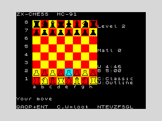

# ZX-CHESS

A chess engine and game for the **I.C.E. Felix HC-91 / ZX Spectrum**,
written in Z80 assembly and assembled into a bootable cassette tape that
runs on the [hc91emu](../README.md) emulator (and on real hardware).

It is built by analysing how the best open-source engines work
(Stockfish, Leela/lc0, and the engines lichess runs) and re-deriving the
same algorithms under 8-bit constraints: a 3.5 MHz Z80, 48 KB of RAM, no
bitboards, no fast multiply. The design and the staged plan to take it
from "legal and playable" to "club-strength with analysis" are in
[ROADMAP.md](ROADMAP.md).


*A complete game (Claude vs the engine at Level 2) played out on the HC-91
emulator, ending in 32.Rg5#. See [CLAUDE_VS_ENGINE.md](CLAUDE_VS_ENGINE.md)
and [SELFPLAY_EXPERIMENT.md](SELFPLAY_EXPERIMENT.md).*



## Status

**Phases 1–4 are implemented and tested; Phase 5's core is in place.**
It is a full, rules-correct game against a genuinely searching engine:

- **0x88** board; full legal move generation incl. **castling, en
  passant, promotion**; checkmate / stalemate / fifty-move / **threefold
  repetition** / **insufficient-material** draws
- **negamax alpha-beta** with **iterative deepening**, **aspiration
  windows**, **quiescence**, **null-move** and **reverse-futility**
  pruning, and a **transposition table** keyed by an
  incrementally-maintained **Zobrist** hash — 8 KB on the 48K, growing to
  64 KB across the spare RAM banks on a 128K machine
- move ordering by **TT move + PV + MVV-LVA + killer moves + history**
- **tapered** evaluation (endgame king centralisation), **bishop pair**,
  **doubled/isolated/passed pawns**, **king-safety pawn shield**, a
  **KQK/KRK mating drive**, material + piece-square tables
- **perft self-test** (press `T`) proving the move generator against the
  canonical counts — start position to depth 4 plus Kiwipete, an
  en-passant and a promotion position — and verifying the Zobrist key
- **two-player** mode, **take-back/undo**, a promotion chooser, a
  cursor-driven **set-up board editor**, beeper move sound, an **analysis
  readout** (opening name, the engine's last move, its evaluation and the
  material balance), per-side **chess clocks** with flag-fall, and an
  endgame demo loader — selectable strength (depth 1–5), **switchable
  board colour schemes** (`C`), board flip, new game

See [ROADMAP.md](ROADMAP.md) for the phase-by-phase status and the
remaining "excellence" items (opening book, KQK/KRK endgame logic,
PVS/LMR, FEN + save/load, clocks, AY sound, 128K-banked TT, UCI bridge).

## Build & run

Requires `pasmo` (`apt-get install pasmo`) and `python3`, plus a built
emulator and the 48K ROM.

```sh
# from the repo root: build the emulator and fetch ROMs once
make                      # builds build/hc91emu
tools/get_roms.sh         # fetches roms/48.rom (and the HC family)

cd chess
make            # assemble chess.bin and wrap chess.tap
make test       # headless smoke test (golden board + engine reply)
make play       # interactive SDL window (needs SDL2)
```

To run it by hand on the emulator:

```sh
build/hc91emu --machine 48k --rom roms/48.rom chess/chess.tap \
              --autoload --sdl --scale 3
```

It also runs on the HC-91 itself (`--machine hc91 --rom roms/hc91.rom`)
and every other machine the emulator supports — the program only uses the
ROM character set, so it is fully 48K-compatible.

## Controls

| Key | Action |
|-----|--------|
| `Q` / `A` | move cursor up / down a rank |
| `O` / `P` | move cursor left / right a file |
| `ENTER` / `SPACE` | pick up the piece under the cursor; move it; or deselect |
| `1`–`5` | set engine strength (search depth) |
| `Z` | take back / undo |
| `V` | toggle two-player (human vs human) |
| `E` | load a K+R vs K endgame demo |
| `F` | flip the board |
| `N` | new game |
| `S` | open the set-up board editor |
| `C` | cycle the board colour scheme |
| `W` | toggle white pieces: outline / white fill |
| `G` / `L` | save / load the game to / from tape |
| `T` | run the perft + Zobrist self-test |

On a pawn promotion the game prompts for the piece (`Q`/`R`/`B`/`N`).

In the **set-up editor**, `Q`/`A`/`O`/`P` move the cursor, `SPACE` cycles the
square through *empty → white pieces → black pieces*, `W` toggles the side to
move, `C` clears the board, and `ENTER` starts a game from the position you
built (kings, hash key, game phase and evaluation accumulators are all
recomputed from scratch). Castling rights and the en-passant square are
cleared for hand-placed positions.

You play White (bottom). Select your piece, move the cursor to the
destination and confirm. Promotions auto-queen for now (a Q/R/B/N chooser
is a planned refinement). When the game ends, `SPACE` or `N` starts a new
one. The panel to the right shows the level and, after each engine move,
its move and evaluation.

## How it works (the 8-bit engine)

### Board — 0x88 mailbox
The board is a 128-byte array indexed `square = rank*16 + file`. The high
bit of each nibble makes the famous off-board test a single instruction:
`square AND 0x88` is non-zero exactly when a move has slid off the 8×8.
The array is page-aligned at `0xE000`, so a board lookup is just
`H=0xE0, L=square` — no address arithmetic. This is the standard 8-bit
representation precisely because bitboards need 64-bit registers a Z80
does not have.

Pieces are one byte: type in bits 0–2 (1=P…6=K), colour in bit 3. Empty
is 0. Colour and type tests are single `AND`s.

### Move generation — direction offsets
Each piece type has a table of 0x88 offsets. Knights and kings *hop*
(add offset, test 0x88, classify the target). Bishops, rooks and queens
*slide* (keep adding the offset until off-board or blocked). Pawns are
handled per colour: single/double push, diagonal captures, en passant
against the recorded target square, and four promotion moves on the last
rank. The result is a list of `{from, to, flag}` records in a per-ply
buffer.

### Legality, attacks, make/unmake
`isAttacked(square, side)` answers "is this square attacked?" by probing
knight/king offsets, the two pawn-attack squares, and bishop/rook/queen
rays — the same routine drives check detection and (later) castling-
through-check. Legal moves are the pseudo-legal ones that don't leave
your own king attacked, found by `make → test → unmake`. `makeMove`
updates the board, king cache, castling rights, en-passant square,
halfmove clock and side, pushing everything needed onto a per-ply undo
stack so `unmakeMove` is exact — the foundation every search needs.

### Search — alpha-beta negamax
A **negamax alpha-beta** search over `searchPly`-indexed frames (best
score, alpha/beta, move pointer, depth — kept in RAM, not on the
hardware stack). On top of it: **iterative deepening** (carrying the
previous depth's best move forward as a PV hint), a **quiescence**
search at the leaves (captures + promotions, stand-pat) to kill the
horizon effect, **null-move pruning**, and a **transposition table**
keyed by a 16-bit **Zobrist** hash that is maintained incrementally in
make/unmake and verified against a from-scratch recompute in the perft
self-test. The table is 8 KB (1024 buckets) on the 48K; on a 128K
machine it grows to 64 KB (8192 buckets) hosted across the four spare
RAM banks, paged through `0x7FFD` into the `0xC000` window with a
register-only access inside a `DI`/`EI` guard so the workspace and stack
(also up there) stay coherent. Moves are ordered TT-move → PV →
MVV-LVA captures (with a cheap **static-exchange** check that demotes
captures losing material on a defended square) → killers → quiet. Mate
scores carry the ply so the engine prefers the quickest mate and the
longest defence. Iterative deepening is **clock-aware**: once a move has
spent its slice of the remaining clock it stops before the next, slower
iteration, so the engine paces itself instead of always paying full depth.

### Evaluation — tapered material + piece-square tables
Leaf positions score material (P=100, N=320, B=330, R=500, Q=900
centipawns) plus a **piece-square table** per piece (knights to the
centre, rooks to the seventh, pawns rewarded for advancing; Black's
tables are White's mirrored by one XOR). The king table is **tapered**:
a middlegame table that keeps the king tucked away switches, below a
non-pawn material threshold, to an endgame table that centralises it.
Added on top: a **bishop-pair** bonus and **doubled / isolated** pawn
penalties.

### Display
The 8×8 board is drawn as 2×2 character cells per square (128×128 px),
with hand-designed **16×16 piece glyphs** ([pieces.py](pieces.py) turns
ASCII art into the data). Because the ZX ULA stores a single ink + paper
per 8×8 cell, solid white pieces would vanish on light squares — and a
white fill *plus* a dark contour *plus* the square colour can't coexist in
one cell. So [pieces.py](pieces.py) emits two glyph sets — a **solid
silhouette for Black** and a **hollow black-outline ("contour") for
White** — both inked black, which keeps both sides legible on every square
colour (white pieces read as an outline with the square showing through).

White pieces have two display modes, toggled in-game with **`W`** (shown on
the panel as `W:<mode>`): **Outline** (the default — a black contour with
the square colour showing through) or **Filled** (a solid white silhouette
with no contour). The two modes have **separate colour-scheme sets**,
because a solid white body and a solid black body need *mid-tone* squares
to both read, whereas outlines want light squares:

- **Outline** schemes (light squares, black ink reads): **Classic**
  (yellow/red), **Meadow** (yellow/green), **Clean** (white/cyan).
- **Filled** schemes (mid-tone squares, both solid colours read):
  **Holly** (green/red), **Orchid** (green/magenta), **Coral** (red/cyan).

`C` cycles whichever set matches the current mode; the panel shows the
active scheme (`C:<name>`) and style (`W:<mode>`).

The board colour scheme is switchable in-game with **`C`** (shown on the
panel as `C:<name>`): **Classic** (yellow/red, the default), **Meadow**
(yellow/green) and **Clean** (white/cyan). Each scheme is four attribute
bytes in `schemeTable` (light, dark, cursor, selected); the cursor and
picked-up square highlights shift per scheme to stay distinct from the
squares. Text uses the ROM character set, so nothing here depends on
paging the ROM out.

## Files

| File | Purpose |
|------|---------|
| `chess.asm` | entry, game loop, board state, display, keyboard, UI, take-back |
| `movegen.inc` | 0x88 move generation (incl. castling), attacks, make/unmake, legal filter, draws |
| `engine.inc` | alpha-beta + quiescence + null-move search, ordering, tapered eval, tables |
| `zobrist.inc` | incremental Zobrist hashing + from-scratch key recompute |
| `tt.inc` | transposition table (48K direct / 128K banked) probe/store and per-ply search-array pointers |
| `perft.inc` | perft node counter, position loader, and the self-test screen |
| `pieces.py` → `pieces.inc` | 16×16 piece glyph generator and its output |
| `bookgen.py` | host-side generator for the position-keyed opening book |
| `tt_check.py` | snapshot checker for the 128K banked-TT test |
| `Makefile` | build the tape, run the smoke + perft + save/load + 128K-TT tests, launch interactively |
| `initial_golden.png` | golden screenshot for the smoke test |

The generic assemble-to-bootable-tape tool is
[`tools/zxtap.py`](../tools/zxtap.py).
