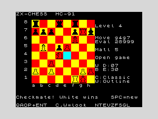

# Sample game — ZX-CHESS plays itself

A complete game played **entirely by the engine against itself**, driven by
an AI agent that interfaced with the running ZX-CHESS program on the HC-91
emulator — reading the game state straight from machine memory (the board
array, side-to-move, game-state and a move-history buffer) rather than from
screenshots, and letting the engine choose every move.

To get a decisive result out of an engine that otherwise draws against
itself, the two sides played at **odds**: White searched to depth 4, Black
to depth 1, with the opening book switched off so weak Black had to find
its own moves. The strong side duly converted and **checkmated** the weak
side.

* **Result:** **1-0** — White checkmates Black (`Qg7#`), 19 moves.
* **Setup:** engine vs engine, White depth 4 / Black depth 1, no book.
* **Verified:** the program's own terminal detection reported checkmate
  (game-state = "black mated", evaluation `+28999` = a mate score).

## Moves

```
 1. e4    e5      2. Nc3   Nf6     3. Nf3   Nc6     4. d4    Bd6
 5. Bb5   Bb4     6. Bg5   exd4    7. Nxd4  Bxc3    8. bxc3  Ne5
 9. O-O   O-O    10. f4    Ng4    11. e5    Ne3    12. Qf3   Nxf1
13. Rxf1  h6     14. Bh4   g5     15. fxg5  hxg5   16. Bxg5  d5
17. Bxf6  Bg4    18. Qxg4  Kh7    19. Qg7#
```

(Notation is from the engine's own move list; squares are read from the
`moveLog` history buffer. The lone non-engine action was the opening `1.e4`
keystroke used to hand control to the self-playing engine.)



## Final position — `19.Qg7#`

White's queen on g7 is defended by the bishop on f6; the Black king on h7
has no escape.

```
    8  r . . q . r . .
    7  p p p . . p Q k
    6  . . . . . B . .
    5  . B . p P . . .
    4  . . . N . . . .
    3  . . P . . . . .
    2  P . P . . . P P
    1  . . . . . R K .
       a b c d e f g h
```

`Q`/`B`/`N`/`R`/`K`/`P` = White pieces, lower-case = Black.

## How it was produced

The agent:

1. booted the bundled `chess.tap` on the emulator and saved a snapshot;
2. set `humanSide = 0xFF` so the engine's AI plays *both* colours, with
   `aiDepth = 4` (White) and `blackDepth = 1` (Black), and disabled the book;
3. let the engine play on, periodically topping up the clocks (so neither
   side flags on time during the much-faster-than-real-time turbo run);
4. detected the end from the game-state byte and read the whole move list
   from the in-memory `moveLog` buffer — no OCR, no screenshots.

Two engine bugs were found and fixed in the course of getting a game to run
to completion: an infinite loop in the passed-pawn evaluation (a clobbered
loop counter), search move-buffers that had grown to overwrite the piece
glyphs, and a transposition-table cutoff at the root that could make the
engine return no move at all. See the git history for details.
