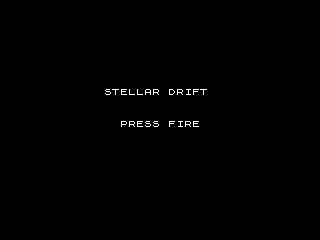
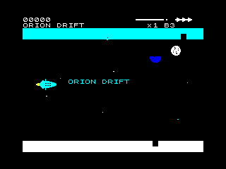

# STELLAR DRIFT

A cave-flyer for the **HC-91 / ZX Spectrum 48K** (with **128K** extras),
written in Z80 assembly. You pilot a side-on spaceship cruising
left-to-right through a series of colour-themed *zones*: **dodge** the
asteroids and enemy fire, **shoot** what you can, **collect** crystals and
power-ups, and **beat the zone boss** — with beeper sound effects on 48K and
an AY soundtrack on 128K.




## Controls

| Action | QAOP | Cursor | Kempston |
|--------|------|--------|----------|
| Up     | **Q** | **7** | up   |
| Down   | **A** | **6** | down |
| Left   | **O** | **5** | left |
| Right  | **P** | **8** | right|
| Fire   | **Space** | **Space** | fire |

Pick **QAOP** or **Cursor** keys on the title (keys **1** / **2**), or press
**D** to **define your own** keys; the Kempston joystick is always live.
Press **M** to choose your **ship** from six designs (A–F; A is the default),
**3** to set the skill (Cadet/Pilot/Ace), and **4**/**5**/**6** to toggle
music, the screen-flash (photosensitivity) and a slow practice mode. **S**/
**L** save/load the high-score table to tape. **H** pauses. Press **Fire**
to start and to continue after **GAME OVER**; hold Fire to stream shots (and
to charge a piercing bolt). Press **B** for a screen-clearing **smart-bomb**.

If left idle, the title runs an **attract-mode demo**.

*Cheat keys (QA):* hold **I** for invincibility, hold **G** for all
power-ups, press **K** to skip a zone.

## Gameplay

- **Asteroids** and **enemy craft** (weavers, swooping divers, drifting
  mines, homing drones and wall turrets) arrive in per-zone scripted waves;
  enemies weave and shoot back. Touching a hazard, taking a hit, **or flying
  into the cave walls** costs a life (you respawn with brief invulnerability).
- Chain kills for a **combo multiplier**, and skim enemy fire for **graze**
  bonuses. Later zones throw in a multi-hit **warship** mini-boss.
- **Crystals** are **+10**; shooting a hazard is **+5**; the boss is **+200**.
- **Power-up pods** grant, in turn: spread shot, rapid fire, a shield, and a
  speed boost (shown as **T R S F** in the HUD).
- Each zone ends with a **boss**; beat it for a bonus and a **BONUS STAGE**
  crystal run, then the next zone. Four named zones cycle (Orion Drift,
  Crimson Veil, Sapphire Expanse, Magenta Storm); each keeps a black backdrop
  (so the objects stand out) with its own star/terrain colour, and gets
  denser than the last.
- **Extra life** every 1000 points. Make the **high-score table** and enter
  your initials.

## Building

Needs a Z80 assembler (`pasmo`) and Python 3:

```sh
sudo apt-get install -y pasmo        # one-time
./build.sh                           # -> build/game.tap and build/game.tzx
```

`build.sh`:
1. `tools/mksprites.py` — turns the ASCII-art sprites into `src/sprites.inc`.
2. `pasmo` — assembles `src/game.asm` to a raw binary at `$8000`.
3. captures the title as a **loading screen** (`build/loading.scr`) by
   running the emulator once.
4. `tools/mktap.py` — wraps the binary + loading screen into a `.tap` (and a
   `.tzx`) with a BASIC autoloader (`LOAD ""SCREEN$: LOAD ""CODE`).

## Running

```sh
# interactive (SDL window; Tab = turbo).  Use 128K for the AY soundtrack:
../build/hc91emu --machine hc128 --autoload --kempston --sdl game/build/game.tap

# headless screenshot (handy for development)
../build/hc91emu --autoload --turbo --kempston \
    --joy "1500-1508:F" --frames 1700 \
    --screenshot shot.png game/build/game.tap
```

`game/build/game.tap` / `.tzx` also load in any ZX Spectrum emulator or on
real hardware. On a 48K machine the AY writes are ignored (beeper still
plays); on a 128K/HC-128 the soundtrack and explosion noise come alive.

## How it works

The whole game is one Z80 source file, `src/game.asm`:

- **`build_addrtab`** precomputes the 192 interleaved screen-row addresses.
- **Pre-shifted sprites** (`build_preshift` → `psbuf`): every 16×16 sprite's
  eight sub-cell shifts are computed once at startup, so `draw_sprite_ps` is a
  plain masked copy with no per-row shift loop. The player ship and boss use a
  wider **24×16** blitter (`draw_ship`).
- Everything moving is an entry in a fixed array (objects, bullets, enemy
  bullets, explosions, stars); each is erased, updated, collided and redrawn
  per frame, with the player drawn last (on top).
- **Banded backdrops** (`attr_row`) give each zone sky/mid/ground colour
  bands; the attribute blitter paints per row so sprites never bleed across.
- **Scrolling cave terrain** (ceiling + floor) and a **3-layer parallax**
  starfield sell the flight.
- **Sound**: 48K beeper SFX (border-preserving square waves) plus a 128K AY
  melody and noise channel.
- **IM2** interrupt clock; the HUD only repaints values that changed.
- Input reads the keyboard half-rows directly and the Kempston port `$1F`.

See **`ROADMAP.md`** — every item is implemented (✅).

## Files

```
src/game.asm       the game
src/sprites.inc    generated sprite data (do not edit by hand)
tools/mksprites.py ASCII-art -> sprite data
tools/mktap.py     raw binary -> .tap / .tzx with BASIC loader + screen
build.sh           build everything
.github/workflows/game.yml   CI: assemble + headless smoke tests
```
