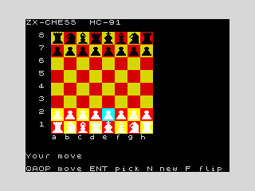

# ZX-CHESS

A chess engine and game for the **I.C.E. Felix HC-91 / ZX Spectrum**,
written in Z80 assembly and assembled into a bootable cassette tape that
runs on the [hc91emu](../../README.md) emulator (and on real hardware).

It is built by analysing how the best open-source engines work
(Stockfish, Leela/lc0, and the engines lichess runs) and re-deriving the
same algorithms under 8-bit constraints: a 3.5 MHz Z80, 48 KB of RAM, no
bitboards, no fast multiply. The design and the staged plan to take it
from "legal and playable" to "club-strength with analysis" are in
[ROADMAP.md](ROADMAP.md).



## Status

**Phase 1 (Foundation) is complete and playable.** You get a full,
rules-correct game against a real search:

- 0x88 board, full legal move generation including **castling, en passant
  and promotion**
- check / checkmate / stalemate / fifty-move detection, "Check!" alerts
- a **negamax** search with material + **piece-square-table** evaluation,
  selectable strength (depth 1–5)
- a 16×16-piece graphical board with cursor input, labels, status line,
  board flip and new-game

See the roadmap for Stabilization (perft, repetition, notation),
Improvement (quiescence, ordering, king safety, opening book),
Optimization (PVS, transposition table, pruning, 128K banking) and
Excellence (endgame knowledge, analysis mode, game I/O, UCI bridge).

## Build & run

Requires `pasmo` (`apt-get install pasmo`) and `python3`, plus a built
emulator and the 48K ROM.

```sh
# from the repo root: build the emulator and fetch ROMs once
make                      # builds build/hc91emu
tools/get_roms.sh         # fetches roms/48.rom (and the HC family)

cd game/chess
make            # assemble chess.bin and wrap chess.tap
make test       # headless smoke test (golden board + engine reply)
make play       # interactive SDL window (needs SDL2)
```

To run it by hand on the emulator:

```sh
build/hc91emu --machine 48k --rom roms/48.rom game/chess/chess.tap \
              --autoload --sdl --scale 3
```

It also runs on the HC-91 itself (`--machine hc91 --rom roms/hc91.rom`)
and every other machine the emulator supports — the program only uses the
ROM character set, so it is fully 48K-compatible.

## Controls

| Key | Action |
|-----|--------|
| `Q` / `A` | move cursor up / down a rank |
| `O` / `P` | move cursor left / right a file |
| `ENTER` / `SPACE` | pick up the piece under the cursor; move it; or deselect |
| `1`–`5` | set engine strength (search depth) |
| `F` | flip the board |
| `N` | new game |

You play White (bottom). Select your piece, move the cursor to the
destination and confirm. Promotions auto-queen for now (a Q/R/B/N chooser
is a Stabilization-phase item). When the game ends, `SPACE` or `N` starts
a new one.

## How it works (the 8-bit engine)

### Board — 0x88 mailbox
The board is a 128-byte array indexed `square = rank*16 + file`. The high
bit of each nibble makes the famous off-board test a single instruction:
`square AND 0x88` is non-zero exactly when a move has slid off the 8×8.
The array is page-aligned at `0xE000`, so a board lookup is just
`H=0xE0, L=square` — no address arithmetic. This is the standard 8-bit
representation precisely because bitboards need 64-bit registers a Z80
does not have.

Pieces are one byte: type in bits 0–2 (1=P…6=K), colour in bit 3. Empty
is 0. Colour and type tests are single `AND`s.

### Move generation — direction offsets
Each piece type has a table of 0x88 offsets. Knights and kings *hop*
(add offset, test 0x88, classify the target). Bishops, rooks and queens
*slide* (keep adding the offset until off-board or blocked). Pawns are
handled per colour: single/double push, diagonal captures, en passant
against the recorded target square, and four promotion moves on the last
rank. The result is a list of `{from, to, flag}` records in a per-ply
buffer.

### Legality, attacks, make/unmake
`isAttacked(square, side)` answers "is this square attacked?" by probing
knight/king offsets, the two pawn-attack squares, and bishop/rook/queen
rays — the same routine drives check detection and (later) castling-
through-check. Legal moves are the pseudo-legal ones that don't leave
your own king attacked, found by `make → test → unmake`. `makeMove`
updates the board, king cache, castling rights, en-passant square,
halfmove clock and side, pushing everything needed onto a per-ply undo
stack so `unmakeMove` is exact — the foundation every search needs.

### Search — negamax (α-β ready)
The search is a clean fixed-depth **negamax**: one routine that scores a
position from the side-to-move's perspective and recurses. Mate scores
carry the ply so the engine prefers the quickest mate and the longest
defence. The per-ply state (best score, move pointer, remaining count,
depth) lives in `searchPly`-indexed arrays rather than on the hardware
stack, which is exactly the frame α-β, PVS, killers and a transposition
table slot into during the Optimization phase — no rewrite required.

### Evaluation — material + piece-square tables
Leaf positions are scored as material (P=100, N=320, B=330, R=500,
Q=900 centipawns) plus a **piece-square table** for each piece that
encodes classical chess knowledge: knights belong in the centre, rooks on
the seventh, kings castled and tucked away in the middlegame, pawns
rewarded for advancing. Black's tables are White's mirrored by one XOR.
This captures most of what a hand-crafted classical evaluator does; the
roadmap tapers it (middlegame/endgame blend) and adds pawn structure and
king safety.

### Display
The 8×8 board is drawn as 2×2 character cells per square (128×128 px),
with hand-designed **16×16 piece silhouettes** ([pieces.py](pieces.py)
turns ASCII art into the glyph data). Piece colour is just the cell ink
attribute, so one glyph set serves both sides. Text uses the ROM
character set, so nothing here depends on paging the ROM out.

## Files

| File | Purpose |
|------|---------|
| `chess.asm` | entry, game loop, board state, display, keyboard, UI |
| `movegen.inc` | 0x88 move generation, attacks, make/unmake, legal filter, terminal detection |
| `engine.inc` | evaluation, negamax search, material & piece-square tables |
| `pieces.py` → `pieces.inc` | 16×16 piece glyph generator and its output |
| `Makefile` | build the tape, run the smoke test, launch interactively |
| `initial_golden.png` | golden screenshot for the smoke test |

The generic assemble-to-bootable-tape tool is
[`tools/zxtap.py`](../../tools/zxtap.py).
